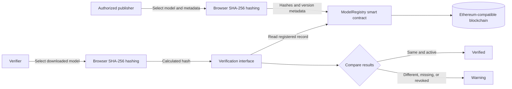

# ModelGuard

## Blockchain-Based AI Model Provenance and Integrity Verification

ModelGuard is a decentralized registry for verifying the origin, version, integrity, and revocation status of AI model files.

An authorized model publisher calculates a cryptographic hash (digital fingerprint) of a model file and registers that hash with version and provenance information on a blockchain. Anyone can later hash a downloaded or deployed model and compare it with the registered value. If even one byte of the file changes, its hash changes and ModelGuard reports that it does not match the registered artifact.

> ModelGuard does **not** require the team to train an AI model. The project can use a small, existing model artifact for demonstration. The assessed work is the blockchain registry, access control, version history, file hashing, verification, and revocation workflow.

For a complete two-wallet walkthrough of every user-facing scenario, see [`docs/manual-testing/README.md`](docs/manual-testing/README.md).

## 1. Problem statement

AI models are distributed as files such as ONNX, TensorFlow Lite, PyTorch, or other serialized artifacts. Between publication and deployment, a model could be:

- replaced with an unauthorized file;
- modified to contain malicious or backdoor behaviour;
- incorrectly presented as an official version;
- used after its publisher has revoked it; or
- separated from reliable information about its publisher and origin.

A normal website or database can publish checksums, but its administrator can later replace both the file and its checksum. ModelGuard records the fingerprint and history on a tamper-resistant ledger, with each registration linked to the publisher's blockchain address.

## 2. What ModelGuard proves

ModelGuard can prove that:

- a file is byte-for-byte identical to a registered model artifact;
- the record was created by an authorized publisher wallet;
- the model was registered at a particular blockchain time;
- the claimed version exists in the registry;
- the version has or has not been revoked; and
- multiple releases belong to a visible version history.

ModelGuard does **not** prove that:

- the model is accurate, fair, unbiased, or safe;
- the training data was ethically or legally obtained;
- the publisher's original model was free from backdoors; or
- the metadata submitted by an authorized publisher is truthful.

This distinction should be stated clearly in the report and presentation.

## 3. Minimum viable product

The first working version should support four operations:

1. **Register:** An authorized publisher registers a model name, version, model hash, provenance hash, and optional metadata location.
2. **Verify:** A user selects a local model file. The browser hashes it and compares the result with the blockchain record.
3. **Inspect:** A user views the publisher, registration time, version, provenance information, and status.
4. **Revoke:** An authorized publisher marks a compromised or obsolete version as revoked without deleting its history.

Do not add model training, inference, NFTs, payments, IPFS, or a public testnet until these four operations work locally.

## 4. Proposed architecture



The model file stays on the user's computer or in ordinary off-chain storage. Only fixed-size hashes and small metadata records are stored on-chain.

## 5. Suggested technology stack

| Layer | Suggested technology | Purpose |
|---|---|---|
| Blockchain | Local Hardhat Network initially | Free and repeatable development blockchain |
| Smart contract | Solidity 0.8.x | Model registry and authorization rules |
| Contract library | OpenZeppelin Contracts | Reusable role-based access control |
| Contract tooling | Hardhat 3 with TypeScript | Compilation, tests and deployment |
| Frontend | React with Vite | Publisher and verifier interface |
| Blockchain client | ethers v6 | Connect the browser wallet and contract |
| Wallet | MetaMask or another EIP-1193 wallet | Identify publishers and sign transactions |
| File hashing | Browser Web Crypto API, SHA-256 | Calculate hashes without uploading files |
| Optional network | Ethereum Sepolia | Final public demonstration after local testing |

Use the current active-LTS Node.js version supported by Hardhat. Confirm the requirement in the official Hardhat documentation before installation.

## 6. Suggested repository structure

```text
modelguard/
|-- contracts/
|   `-- ModelRegistry.sol
|-- ignition/
|   `-- modules/
|       `-- ModelRegistry.ts
|-- test/
|   `-- ModelRegistry.ts
|-- frontend/
|   |-- src/
|   |   |-- components/
|   |   |   |-- RegisterModel.jsx
|   |   |   |-- VerifyModel.jsx
|   |   |   `-- ModelDetails.jsx
|   |   |-- contracts/
|   |   |   |-- ModelRegistry.json
|   |   |   `-- deployment.json
|   |   |-- utils/
|   |   |   `-- hashFile.js
|   |   |-- App.jsx
|   |   `-- main.jsx
|   `-- .env.example
|-- sample-models/
|   |-- README.md
|   |-- model-v1-original.example
|   `-- model-v1-modified.example
|-- docs/
|   |-- architecture.md
|   `-- demo-script.md
|-- .gitignore
|-- hardhat.config.ts
|-- package.json
`-- README.md
```

The actual filenames created by the Hardhat initializer may differ slightly. Keep the same separation between contracts, tests, deployment, frontend, and demonstration artifacts.

## 7. Smart-contract design

### 7.1 Roles

Use two roles:

- `DEFAULT_ADMIN_ROLE`: grants and removes publisher permissions.
- `PUBLISHER_ROLE`: registers and revokes AI model versions.

For the prototype, the contract deployer receives both roles. A second wallet should be used during testing to demonstrate that an unauthorized user cannot register a model.

### 7.2 Record structure

A model version can be represented conceptually as:

```solidity
struct ModelRecord {
    string modelName;
    string version;
    bytes32 modelHash;
    bytes32 provenanceHash;
    string metadataURI;
    address publisher;
    uint256 registeredAt;
    bool revoked;
}
```

`provenanceHash` is the SHA-256 hash of a small JSON manifest describing the claimed source, model format, source URL, licence, dataset name/version, and other useful release information. The actual manifest remains off-chain.

Create a unique identifier for each version:

```solidity
bytes32 modelId = keccak256(abi.encode(modelName, version));
```

Using `abi.encode` avoids ambiguous combinations that can occur when variable-length values are tightly packed.

### 7.3 Required functions

The contract should provide functions equivalent to:

```solidity
registerModel(
    string modelName,
    string version,
    bytes32 modelHash,
    bytes32 provenanceHash,
    string metadataURI
)

revokeModel(string modelName, string version, string reason)

getModel(string modelName, string version)

modelExists(string modelName, string version)
```

Verification itself can happen in the frontend: calculate the selected file's SHA-256 hash, read the registered record, and compare the two `bytes32` values. This is a read-only operation and does not need a blockchain transaction or gas.

### 7.4 Events

Emit events so the history can be audited:

```solidity
event ModelRegistered(
    bytes32 indexed modelId,
    string modelName,
    string version,
    bytes32 modelHash,
    address indexed publisher
);

event ModelRevoked(
    bytes32 indexed modelId,
    address indexed publisher,
    string reason
);
```

### 7.5 Contract rules

Enforce these rules:

- only an address with `PUBLISHER_ROLE` can register a model;
- model name and version cannot be empty;
- model and provenance hashes cannot be zero values;
- the same model name and version cannot be registered twice;
- registration history cannot be deleted or overwritten;
- only the original publisher or an administrator can revoke a version;
- a version cannot be revoked twice; and
- revocation does not remove the original record.

## 8. Build plan

### Phase 1 — Freeze the scope

Before coding, agree that the MVP contains only:

- publisher authorization;
- model-version registration;
- file-hash verification;
- record inspection; and
- model revocation.

Write the problem statement, actors, inputs, outputs, and limitations in `docs/architecture.md`.

**Completion check:** Every team member can explain what the blockchain proves and what it does not prove.

### Phase 2 — Create the Hardhat project

From the intended project directory:

```bash
npm init -y
npm install --save-dev hardhat
npx hardhat --init
npm install @openzeppelin/contracts
```

Choose a TypeScript project when the initializer asks. Keep secrets and generated build artifacts out of source control.

Confirm the initial setup:

```bash
npx hardhat compile
npx hardhat test
```

**Completion check:** The sample contract compiles and its starter tests pass.

### Phase 3 — Implement `ModelRegistry.sol`

1. Import OpenZeppelin `AccessControl`.
2. Define `PUBLISHER_ROLE`.
3. Define `ModelRecord` and the record mapping.
4. Grant the deployer the administrator and publisher roles.
5. Implement registration, lookup, existence, and revocation.
6. Add input validation and custom errors.
7. Emit registration and revocation events.

Prefer custom errors such as `UnauthorizedPublisher`, `ModelAlreadyExists`, `ModelNotFound`, and `ModelAlreadyRevoked` over vague failure messages.

**Completion check:** The contract compiles without warnings that affect correctness.

### Phase 4 — Write contract tests before building the UI

Test at least these cases:

1. The deployer has the administrator and publisher roles.
2. An administrator can authorize another publisher.
3. An authorized publisher can register a model.
4. An unauthorized wallet cannot register a model.
5. A duplicate model name and version is rejected.
6. Empty values and zero hashes are rejected.
7. Two different versions of one model can coexist.
8. A registered record returns the correct hash, publisher, and timestamp.
9. The original publisher can revoke its version.
10. An unauthorized wallet cannot revoke it.
11. A revoked version remains readable and is marked revoked.
12. Registering and revoking emit the expected events.

Run:

```bash
npx hardhat test
```

**Completion check:** All contract tests pass from a clean project checkout.

### Phase 5 — Create the deployment module

Create a Hardhat Ignition module that deploys `ModelRegistry` with the intended administrator address.

Start a local blockchain in terminal 1:

```bash
npx hardhat node
```

Deploy from terminal 2:

```bash
npx hardhat ignition deploy ignition/modules/ModelRegistry.ts --network localhost
```

Record the deployed address. Export or copy only the required contract ABI and address to `frontend/src/contracts/`.

**Completion check:** A command-line script or console call can register and retrieve a model from the local deployment.

### Phase 6 — Prepare demonstration artifacts

No model training is required.

1. Select a small existing model artifact with a licence that permits demonstration and redistribution.
2. Record its source and licence in `sample-models/README.md`.
3. Save an untouched copy as the original demo model.
4. Create a second copy and deliberately change a few bytes.
5. Create a provenance manifest such as:

```json
{
  "modelName": "DemoClassifier",
  "version": "1.0.0",
  "format": "ONNX",
  "publisher": "ModelGuard demonstration team",
  "source": "Document the original model source here",
  "license": "Document the model license here",
  "dataset": {
    "name": "Claimed dataset name",
    "version": "Claimed dataset version"
  }
}
```

Do not claim that your team trained the model. Describe it as an existing artifact used to demonstrate integrity verification.

**Completion check:** The original and deliberately modified files produce different SHA-256 hashes.

### Phase 7 — Implement browser-side hashing

Create `frontend/src/utils/hashFile.js` using the browser Web Crypto API:

1. Read the selected file as an `ArrayBuffer`.
2. Calculate `crypto.subtle.digest("SHA-256", data)`.
3. Convert the resulting 32 bytes into a `0x`-prefixed hexadecimal string.
4. Display the value before the user submits a registration transaction.

Hash files locally in the browser. Do not upload the model to a server merely to calculate its hash.

Use SHA-256 consistently for both registration and verification. The contract only stores the resulting `bytes32`; it does not process the entire model file.

**Completion check:** Repeated hashing of the same file produces the same value, while the modified demo file produces a different value.

### Phase 8 — Build the frontend

Create the React application:

```bash
npm create vite@latest frontend -- --template react
cd frontend
npm install
npm install ethers
npm run dev
```

Build these views:

#### Wallet and network panel

- connect the user's wallet;
- show the connected address and network;
- warn when the wallet is on the wrong network; and
- distinguish an administrator, publisher, and ordinary verifier.

#### Register Model

- available only to authorized publishers;
- accepts model name and semantic version;
- accepts a model file and provenance manifest;
- hashes both files locally;
- shows both hashes for confirmation; and
- sends the registration transaction.

#### Verify Model

- accepts model name, version, and local model file;
- calculates the local hash;
- retrieves the registered record;
- compares both values; and
- displays one clear result:

  - `Verified — active registered model`
  - `Hash mismatch — file may have been modified`
  - `Revoked — this registered version must not be used`
  - `Not registered — no matching model and version`

#### Model Details

- shows the registered hash and provenance hash;
- shows the publisher address and registration time;
- shows the metadata location;
- shows active or revoked status; and
- provides the revoke action only to an authorized wallet.

In ethers v6, wrap an injected browser wallet using `BrowserProvider`, obtain a signer for transactions, and use a provider for read-only calls.

**Completion check:** A user can complete the entire register, verify, alter, re-verify, and revoke scenario through the UI.

### Phase 9 — Connect MetaMask to the local network

When using the standard Hardhat local node, add a development network to MetaMask with values similar to:

```text
Network name: Hardhat Local
RPC URL: http://127.0.0.1:8545
Chain ID: 31337
Currency symbol: ETH
```

Import only one of the temporary development accounts printed by `npx hardhat node`. These accounts and keys are public test credentials. Never send real funds to them and never reuse them on a public network.

Use separate local accounts for:

- administrator/publisher;
- second authorized publisher; and
- unauthorized verifier.

**Completion check:** Permission checks behave differently when the connected wallet changes.

### Phase 10 — End-to-end verification

Run the complete demonstration:

1. Connect the publisher wallet.
2. Select the original model and manifest.
3. Register `DemoClassifier` version `1.0.0`.
4. Connect an ordinary verifier wallet.
5. Verify the original file and receive a green result.
6. Verify the modified copy and receive a hash-mismatch warning.
7. Reconnect the publisher and revoke version `1.0.0`.
8. Verify the original file again and receive a revoked warning.
9. Register version `1.1.0` and show that both historical records remain visible.

**Completion check:** A person unfamiliar with the code can follow these steps without developer assistance.

### Phase 11 — Optional Sepolia deployment

Deploy to a public testnet only after all local tests and the local demonstration work.

1. Create a fresh demonstration wallet.
2. Obtain Sepolia test ETH from a reputable faucet.
3. Select an RPC provider.
4. Put the RPC URL and demonstration private key in a local `.env` file.
5. Add `.env` to `.gitignore` before storing any secret.
6. Configure a `sepolia` network in Hardhat.
7. Deploy with the Ignition module.
8. update the frontend's network, contract address, and ABI.
9. Verify the deployed contract source if time permits.

Never commit private keys, seed phrases, API tokens, or RPC credentials. A public testnet is optional; a correct local blockchain demonstration is sufficient for the MVP unless the lecturer requires public deployment.

## 9. Recommended development order

Do not build everything simultaneously. Use this order:

```text
Requirements
  -> Smart contract
  -> Contract tests
  -> Local deployment
  -> File hashing
  -> Minimal verification page
  -> Registration page
  -> Revocation and history
  -> UI improvements
  -> Optional testnet
  -> Presentation
```

At the end of each step, keep the application in a demonstrable state.

## 10. Security and privacy checklist

- Do not store model files or datasets directly on-chain.
- Do not store confidential dataset information in public metadata.
- Hash the exact file bytes; do not hash a filename or file path.
- Use one documented hash algorithm everywhere.
- Restrict registration and revocation with contract-enforced roles.
- Reject duplicate name/version pairs instead of overwriting records.
- Preserve revoked records for auditability.
- Display the connected wallet and network before transactions.
- Validate inputs in both the frontend and contract.
- Treat metadata URLs as untrusted input when displaying them.
- Do not claim blockchain verifies model quality or publisher honesty.
- Never commit wallet secrets or service credentials.

## 11. Suggested team division

For a four-person group:

| Member | Primary responsibility |
|---|---|
| Member 1 | Smart contract, access control, and deployment |
| Member 2 | Contract tests and security/edge-case testing |
| Member 3 | File hashing, wallet connection, and contract integration |
| Member 4 | Frontend screens, documentation, and presentation |

Everyone should review the final contract and be able to perform the full demonstration. For a smaller group, combine adjacent responsibilities.

## 12. Suggested one-week schedule

| Day | Target |
|---|---|
| 1 | Confirm scope, initialize the repository, and design the contract |
| 2 | Implement the contract and events |
| 3 | Complete tests and local deployment |
| 4 | Implement browser hashing and verification UI |
| 5 | Add registration, record details, and revocation UI |
| 6 | Run security tests, improve error handling, and document the project |
| 7 | Rehearse the three-minute demonstration and prepare final slides |

## 13. Three-minute presentation flow

### 0:00–0:30 — Problem

Explain that an AI model file can be replaced or changed after publication and users need a trustworthy way to identify the authentic version.

### 0:30–1:00 — Solution and architecture

Explain that the model remains off-chain while its hash, publisher, version, provenance hash, timestamp, and revocation status are registered on-chain.

### 1:00–2:20 — Live demonstration

1. Show the registered model record.
2. Verify the original model successfully.
3. Verify the modified model and show the mismatch.
4. Show that a revoked model remains identifiable but is no longer trusted.

### 2:20–3:00 — Security value and limitation

Summarize tamper detection, authorized publication, immutable history, and revocation. State that ModelGuard verifies artifact integrity and registered provenance, not model accuracy or fairness.

## 14. MVP completion checklist

- [ ] The contract uses administrator and publisher roles.
- [ ] Authorized publishers can register unique model versions.
- [ ] Unauthorized wallets are rejected.
- [ ] The frontend hashes files locally with SHA-256.
- [ ] The original demo model verifies successfully.
- [ ] A modified copy produces a mismatch.
- [ ] A publisher can revoke a version.
- [ ] Revoked records remain available and produce a warning.
- [ ] Multiple versions can coexist.
- [ ] Contract tests cover successful and failing cases.
- [ ] No model files or private information are stored on-chain.
- [ ] No secrets are committed to the repository.
- [ ] The team can complete the demonstration in three minutes.

## 15. Possible extensions after the MVP

Only attempt these after the checklist above is complete:

- store the provenance manifest in IPFS and keep its content identifier on-chain;
- support parent-child model lineage, such as a fine-tuned model derived from a base model;
- add publisher signatures to downloadable model manifests;
- list all versions using indexed contract events;
- support organization-level publishers with multisignature administration;
- record security advisories and structured revocation reasons;
- build a command-line verifier for deployment pipelines; or
- integrate verification into a mock AI deployment workflow.

## 16. References

- [Hardhat 3 documentation](https://hardhat.org/docs)
- [OpenZeppelin Contracts](https://docs.openzeppelin.com/contracts)
- [OpenZeppelin access control](https://docs.openzeppelin.com/contracts/5.x/access-control)
- [ethers v6 documentation](https://docs.ethers.org/v6/)
- [Vite getting started](https://vite.dev/guide/)
- [MDN Web Crypto `digest()`](https://developer.mozilla.org/en-US/docs/Web/API/SubtleCrypto/digest)

## 17. Project description for the selection sheet

**Project name:** ModelGuard – Blockchain-Based AI Model Provenance and Integrity Verification

**Domain:** Artificial Intelligence Security / AI Model Provenance

**Application:**

> A blockchain-based system that allows authorized AI model developers to register cryptographic hashes, version information, publisher details, and provenance metadata of released AI models. Users can verify that a downloaded or deployed model matches the authentic registered version, view its version history, and detect modified, unauthorized, or revoked model files. The actual AI models remain off-chain, while only their hashes and provenance records are stored on the blockchain.

